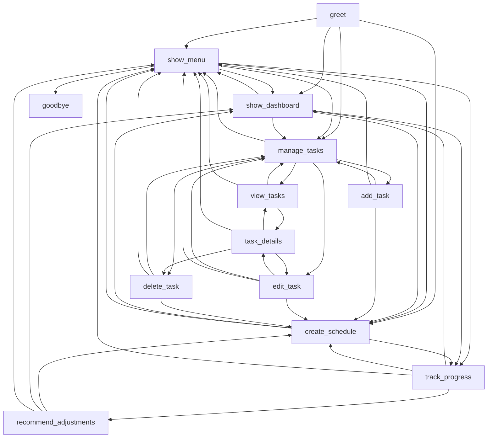

# Day Planner

## User Stories
### 1. Task Management
As a user, I want to be able to add, edit, and delete tasks so that I can manage my to-do list effectively.

### 2. Create Daily Schedule
As a user, I want to create a daily schedule that allocates time for each task, so I can stay organized and focused.
Agent should consider the priority, due date (if there any), and estimated duration (if any) of each task.

### 3. Progress Tracking
As a user, I can change the status of each task in the daily schedule or just skip tasks, where the agent should adjust/recommend
changes to the daily schedule to make the day more effective.

### 4. Break Management
As a user, I want to schedule breaks between tasks, so I can maintain my energy and focus throughout the day. So the agent should suggest optimal break times and durations accordingly.

## Tools available
- create_task
- get_tasks
- update_task
- delete_task
- get_task_by_id
- get_task_summary
- add_time_slot
- get_today_plam
- create_today_plan
- get_or_create_today_plan
- add_time_slot
- assign_task_to_slot
- remove_time_slot
- get_scheduled_tasks
- get_day_summary

